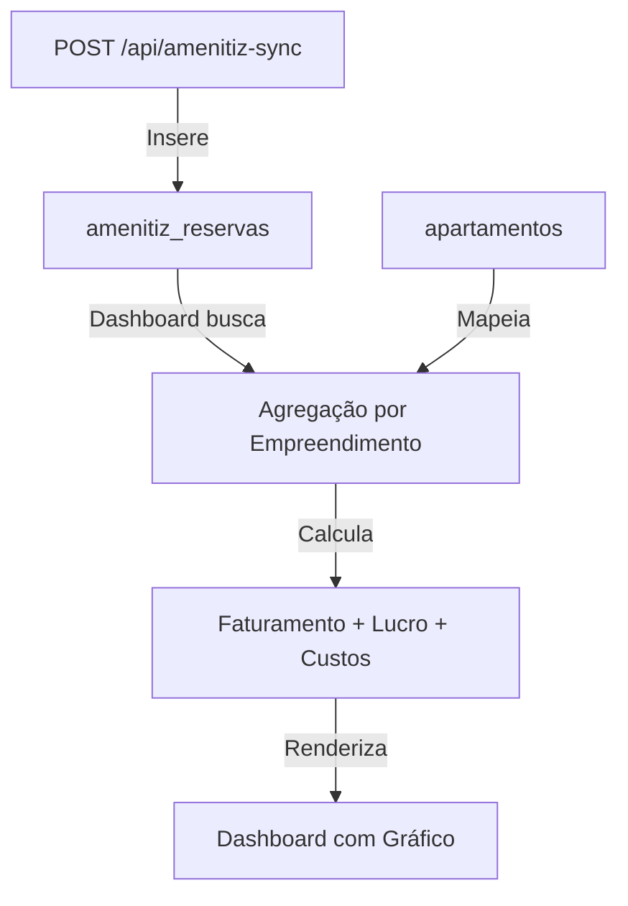

# Atualizações do Dashboard — Integração Amenitiz

## Resumo das Mudanças

O dashboard foi atualizado para renderizar dados diretamente da tabela `amenitiz_reservas` em vez de depender apenas da tabela `diarias`. Isso permite uma integração mais direta com os dados de reservas da Amenitiz.

---

## Arquivo Modificado

### [app/(dashboard)/page.tsx](app/(dashboard)/page.tsx)

**O que foi alterado:**

#### 1. Queries do Banco de Dados (linhas 36-65)

**Antes:**
```typescript
let diariasQuery = supabase
  .from('diarias')
  .select('valor, apartamento_id, tipo_gestao, apartamentos(...)')

// Não pegava dados de amenitiz_reservas
```

**Depois:**
```typescript
// Query para reservas do Amenitiz
let reservasQuery = supabase
  .from('amenitiz_reservas')
  .select('valor_liquido, individual_room_number')

if (mes > 0) reservasQuery = reservasQuery.eq('mes_competencia', mes)
if (ano > 0) reservasQuery = reservasQuery.eq('ano_competencia', ano)
```

**Benefício:** Agora o dashboard busca diretamente de `amenitiz_reservas`, que alimentada pelo endpoint `POST /api/amenitiz-sync`.

---

#### 2. Busca de Apartamentos (linhas 55-56)

**Novo:**
```typescript
const { data: apartamentosData } = await supabase
  .from('apartamentos')
  .select('id, numero, empreendimento_id, empreendimentos(nome)')
```

**Razão:** Necessário para mapear o `individual_room_number` (número do apartamento na reserva) para o nome do empreendimento.

---

#### 3. Cálculo do Faturamento (linhas 72-73)

**Antes:**
```typescript
const faturamentoTotal = diariasData?.reduce((acc, d) => acc + (d.valor || 0), 0) ?? 0
```

**Depois:**
```typescript
const faturamentoTotal = reservasData?.reduce((acc, r) => acc + (r.valor_liquido || 0), 0) ?? 0
```

**Benefício:** Usa `valor_liquido` de `amenitiz_reservas` (valor após taxa de plataforma).

---

#### 4. Mapeamento de Apartamentos para Empreendimentos (linhas 80-87)

**Novo:**
```typescript
// Mapear número do apartamento para empreendimento
const aptMap: Record<string, string> = {}
apartamentosData?.forEach((a: any) => {
  const num = String(a.numero).trim()
  const emp = a.empreendimentos?.nome || ''
  if (emp) aptMap[num] = emp
})
```

**Razão:** Cria um mapa `número_apartamento → nome_empreendimento` para agrupar reservas corretamente.

---

#### 5. Agregação de Reservas por Empreendimento (linhas 91-98)

**Novo:**
```typescript
// Agregar faturamento das reservas por empreendimento
reservasData?.forEach((r: any) => {
  const aptNum = String(r.individual_room_number).trim()
  const empNome = aptMap[aptNum]
  if (empNome) {
    if (!empreendimentoMap[empNome]) empreendimentoMap[empNome] = { fat: 0, custos: 0 }
    empreendimentoMap[empNome].fat += r.valor_liquido || 0
  }
})
```

**Benefício:** Agrupa o `valor_liquido` de todas as reservas por empreendimento.

---

## Como Funciona Agora



### Fluxo de Dados

1. **Sincronização Amenitiz** (`POST /api/amenitiz-sync`)
   - Busca reservas da API Amenitiz
   - Calcula `valor_liquido` (desconta taxa da plataforma)
   - Salva em `amenitiz_reservas` com `mes_competencia` e `ano_competencia`

2. **Dashboard Renderiza**
   - Busca registros de `amenitiz_reservas` filtrando por mês/ano
   - Mapeia `individual_room_number` para empreendimento
   - Agrupa `valor_liquido` por empreendimento
   - Calcula lucro = faturamento (reservas) - custos (tabela `custos`)
   - Renderiza gráfico com dados agregados

---

## Dados Utilizados

### Tabela `amenitiz_reservas`

| Campo | Tipo | Descrição |
|-------|------|-----------|
| `valor_liquido` | numeric | Valor após desconto da taxa de plataforma |
| `individual_room_number` | text | Número do apartamento (ex: "101", "202") |
| `mes_competencia` | integer | Mês da reserva (1-12) |
| `ano_competencia` | integer | Ano da reserva (ex: 2026) |

### Tabela `apartamentos`

| Campo | Tipo | Descrição |
|-------|------|-----------|
| `numero` | integer | Número do apartamento |
| `empreendimento_id` | uuid | Referência para empreendimentos |

### Resultado Final

- **Faturamento** = Soma de `valor_liquido` de todas as reservas
- **Custos** = Soma de valores da tabela `custos`
- **Lucro** = Faturamento - Custos
- **Margem** = (Lucro / Faturamento) × 100%

---

## Testando as Alterações

### 1. Certificar que há dados na `amenitiz_reservas`

Chamar o endpoint para sincronizar dados:

```bash
curl -X POST http://localhost:3000/api/amenitiz-sync \
  -H "Content-Type: application/json" \
  -d '{"mes": 1, "ano": 2026}'
```

### 2. Acessar o Dashboard

- URL: `http://localhost:3000/?mes=1&ano=2026`
- Verificar se os valores de faturamento e lucro estão corretos
- Verificar se o gráfico mostra dados de `amenitiz_reservas`

### 3. Comparar com dados brutos

```sql
SELECT 
  SUM(valor_liquido) as faturamento_total
FROM amenitiz_reservas
WHERE mes_competencia = 1 AND ano_competencia = 2026;
```

---

## Notas Importantes

1. **Filtro por Mês/Ano**: O dashboard agora respeita `mes_competencia` e `ano_competencia` de `amenitiz_reservas`. Se não houver dados sincronizados para um período, o dashboard exibirá "R$ —".

2. **Mapeamento de Apartamentos**: Se um `individual_room_number` não existir na tabela `apartamentos`, essa reserva será ignorada no gráfico (mas continua em `amenitiz_reservas` para auditoria).

3. **Custos**: Continuam sendo buscados da tabela `custos`. O lucro é calculado como: **Faturamento (Amenitiz) - Custos (Tabela Custos)**.

4. **Row Level Security (RLS)**: Apenas usuários autenticados podem ver os dados (ambas as tabelas têm RLS habilitado).

---

## Referências

- Endpoint de Sincronização: [app/api/amenitiz-sync/route.ts](app/api/amenitiz-sync/route.ts)
- Componente de Gráfico: [components/charts/dashboard-charts.tsx](components/charts/dashboard-charts.tsx)
- Schema da API: [supabase/migrations/005_amenitiz_sync_v2.sql](supabase/migrations/005_amenitiz_sync_v2.sql)
